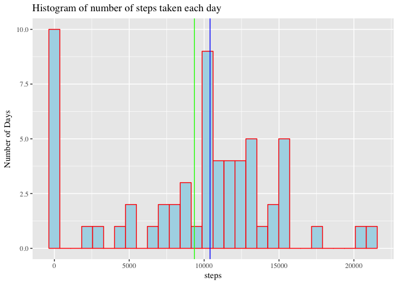
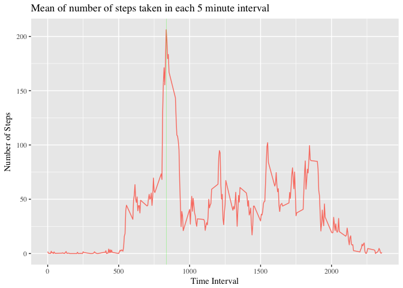
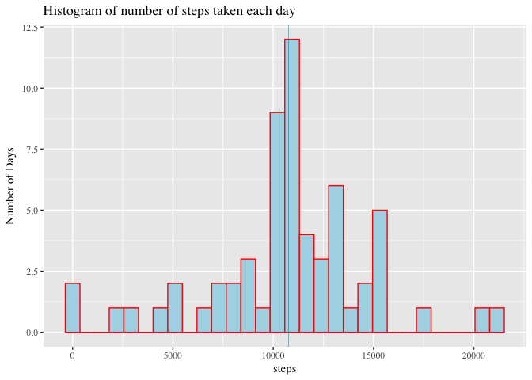
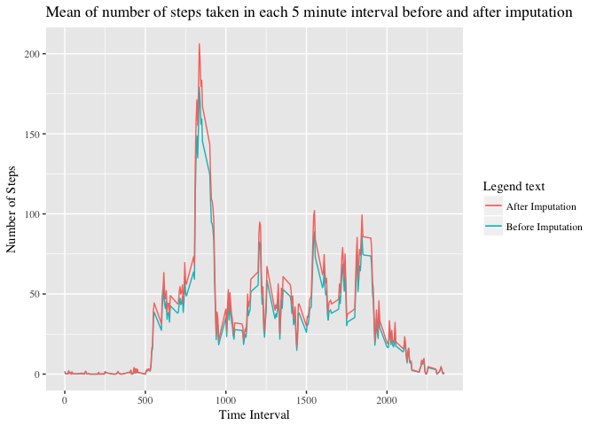
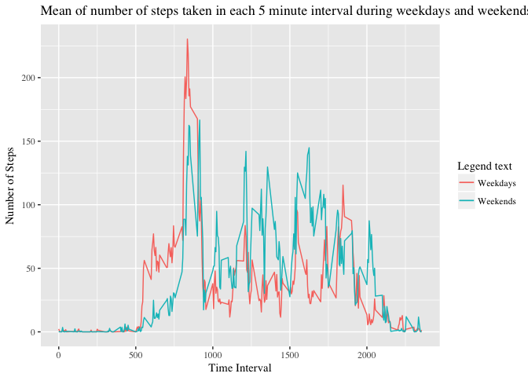

Aaditya Aanand
13 May 2017

### Loading and Exploring Our Dataset

``` r
library(anytime)
```

    ## Warning: package 'anytime' was built under R version 3.3.2

``` r
library(dplyr)
```

    ## 
    ## Attaching package: 'dplyr'

    ## The following objects are masked from 'package:stats':
    ## 
    ##     filter, lag

    ## The following objects are masked from 'package:base':
    ## 
    ##     intersect, setdiff, setequal, union

``` r
library(ggplot2)
```

    ## Warning: package 'ggplot2' was built under R version 3.3.2

``` r
act <- read.csv("activity.csv")
```

Let's explore our data first.

``` r
dim(act)
```

    ## [1] 17568     3

``` r
names(act)
```

    ## [1] "steps"    "date"     "interval"

``` r
str(act)
```

    ## 'data.frame':    17568 obs. of  3 variables:
    ##  $ steps   : int  NA NA NA NA NA NA NA NA NA NA ...
    ##  $ date    : Factor w/ 61 levels "2012-10-01","2012-10-02",..: 1 1 1 1 1 1 1 1 1 1 ...
    ##  $ interval: int  0 5 10 15 20 25 30 35 40 45 ...

``` r
summary(act)
```

    ##      steps                date          interval     
    ##  Min.   :  0.00   2012-10-01:  288   Min.   :   0.0  
    ##  1st Qu.:  0.00   2012-10-02:  288   1st Qu.: 588.8  
    ##  Median :  0.00   2012-10-03:  288   Median :1177.5  
    ##  Mean   : 37.38   2012-10-04:  288   Mean   :1177.5  
    ##  3rd Qu.: 12.00   2012-10-05:  288   3rd Qu.:1766.2  
    ##  Max.   :806.00   2012-10-06:  288   Max.   :2355.0  
    ##  NA's   :2304     (Other)   :15840

``` r
head(act)
```

    ##   steps       date interval
    ## 1    NA 2012-10-01        0
    ## 2    NA 2012-10-01        5
    ## 3    NA 2012-10-01       10
    ## 4    NA 2012-10-01       15
    ## 5    NA 2012-10-01       20
    ## 6    NA 2012-10-01       25

Let us change the type of *date* column from **factor** to **Date** and add a new column for determining whether the given date is a weekend or not.

``` r
act <- mutate(act, date = anytime(date))
str(act)
```

    ## 'data.frame':    17568 obs. of  3 variables:
    ##  $ steps   : int  NA NA NA NA NA NA NA NA NA NA ...
    ##  $ date    : POSIXct, format: "2012-10-01" "2012-10-01" ...
    ##  $ interval: int  0 5 10 15 20 25 30 35 40 45 ...

``` r
## Now, we are sure about the class of "date" variable
temp <- sapply(1:17568, function(x) as.POSIXlt(act$date[x])$wday %in% c(0,6))
act <- mutate(act, weekend = as.numeric(temp))

## Let's look at our data now and its structure
head(act)
```

    ##   steps       date interval weekend
    ## 1    NA 2012-10-01        0       0
    ## 2    NA 2012-10-01        5       0
    ## 3    NA 2012-10-01       10       0
    ## 4    NA 2012-10-01       15       0
    ## 5    NA 2012-10-01       20       0
    ## 6    NA 2012-10-01       25       0

``` r
str(act)
```

    ## 'data.frame':    17568 obs. of  4 variables:
    ##  $ steps   : int  NA NA NA NA NA NA NA NA NA NA ...
    ##  $ date    : POSIXct, format: "2012-10-01" "2012-10-01" ...
    ##  $ interval: int  0 5 10 15 20 25 30 35 40 45 ...
    ##  $ weekend : num  0 0 0 0 0 0 0 0 0 0 ...

``` r
## Everything seems fine now
```

### Mean total number of steps taken per day

``` r
temp <- group_by(act, date)
ss <- as.data.frame(summarise(temp, sum(steps, na.rm = TRUE)))
names(ss) <- c("date", "steps")
head(ss)
```

    ##         date steps
    ## 1 2012-10-01     0
    ## 2 2012-10-02   126
    ## 3 2012-10-03 11352
    ## 4 2012-10-04 12116
    ## 5 2012-10-05 13294
    ## 6 2012-10-06 15420

``` r
## Let's calculate the mean and median of the number of steps taken each day

mean(ss$steps)
```

    ## [1] 9354.23

``` r
median(ss$steps)
```

    ## [1] 10395

``` r
g <- ggplot(data = ss, aes(steps))
g <- g + geom_histogram(color = "red", fill = "light blue")
g <- g + theme_gray(base_family = "Times")
g <- g + labs(title = "Histogram of number of steps taken each day")
g <- g + labs(x = "steps", y = "Number of Days")
g <- g + geom_vline(xintercept = mean(ss$steps), color = "green")
g <- g + geom_vline(xintercept = median(ss$steps), color = "blue")
g
```

    ## `stat_bin()` using `bins = 30`. Pick better value with `binwidth`.



The green line corresponds to the mean value of 9354.23 and the blue line corresponds to the median value of 10395 steps per day.

### Average daily activity pattern

``` r
temp <- group_by(act, interval)
ss <- as.data.frame(summarise(temp, mean(steps, na.rm = TRUE)))
names(ss) <- c("interval", "steps")
head(ss)
```

    ##   interval     steps
    ## 1        0 1.7169811
    ## 2        5 0.3396226
    ## 3       10 0.1320755
    ## 4       15 0.1509434
    ## 5       20 0.0754717
    ## 6       25 2.0943396

``` r
## Finding the interval having maximum number of steps 
x <- which.max(ss$steps)
max_steps <- ss[x, 2]
corr_interval <- ss[x, 1]

max_steps
```

    ## [1] 206.1698

``` r
corr_interval
```

    ## [1] 835

``` r
##Now, let's plot
g <- ggplot(data = ss, aes(interval, steps))
g <- g + geom_line(color = "salmon")
g <- g + theme_gray(base_family = "Times")
g <- g + labs(title = "Mean of number of steps taken in each 5 minute interval")
g <- g + labs(x = "Time Interval", y = "Number of Steps")
g <- g + geom_vline(xintercept = corr_interval, color = "green", size = 0.1)
g
```



Thin green line corresponds for the maximum value of mean number of steps, 206.1698 at the respective time interval of 835.

### Imputing missing values

``` r
sapply(1:4, function(x) sum(is.na(act[x])))
```

    ## [1] 2304    0    0    0

We see that, there are 2304 missing values present in ***steps*** column and in other columns there are no missing values. Hence there are a total of 2304 rows with missing values.

**Missing Values:** Let's fill the NAs corresponding to each interval by the mean of the number of steps taken on that particular interval in the past two months, rounded off to the nearest integer.

``` r
old.act <- act

## creating new dataset 
for(i in 1:17568) {
        if(is.na(act[i, 1]) == TRUE) {
                interval.x <- act[i, 3]
                row.x <- which(ss$interval == interval.x)
                act[i, 1] = round(ss[row.x, 2])
        }
}

## Now, let us look at the head of our old and new datasets
head(old.act)
```

    ##   steps       date interval weekend
    ## 1    NA 2012-10-01        0       0
    ## 2    NA 2012-10-01        5       0
    ## 3    NA 2012-10-01       10       0
    ## 4    NA 2012-10-01       15       0
    ## 5    NA 2012-10-01       20       0
    ## 6    NA 2012-10-01       25       0

``` r
head(act)
```

    ##   steps       date interval weekend
    ## 1     2 2012-10-01        0       0
    ## 2     0 2012-10-01        5       0
    ## 3     0 2012-10-01       10       0
    ## 4     0 2012-10-01       15       0
    ## 5     0 2012-10-01       20       0
    ## 6     2 2012-10-01       25       0

Everything looks fine now.

``` r
temp <- group_by(act, date)
ss <- as.data.frame(summarise(temp, sum(steps, na.rm = TRUE)))
names(ss) <- c("date", "steps")
head(ss)
```

    ##         date steps
    ## 1 2012-10-01 10762
    ## 2 2012-10-02   126
    ## 3 2012-10-03 11352
    ## 4 2012-10-04 12116
    ## 5 2012-10-05 13294
    ## 6 2012-10-06 15420

``` r
## Let's calculate the mean and median of the number of steps taken each day

mean(ss$steps)
```

    ## [1] 10765.64

``` r
median(ss$steps)
```

    ## [1] 10762

``` r
g <- ggplot(data = ss, aes(steps))
g <- g + geom_histogram(color = "red", fill = "light blue")
g <- g + theme_gray(base_family = "Times")
g <- g + labs(title = "Histogram of number of steps taken each day")
g <- g + labs(x = "steps", y = "Number of Days")
g <- g + geom_vline(xintercept = mean(ss$steps), color = "green", size = 0.1)
g <- g + geom_vline(xintercept = median(ss$steps), color = "blue", size = 0.1)
g
```

    ## `stat_bin()` using `bins = 30`. Pick better value with `binwidth`.



The green line corresponds to the mean value of 10765.64 and the blue line corresponds to the median value of 10762 steps per day. We may not see both the line as mean and median values are very close. We see that after imputing the missing values, there is a surge in both mean and median of the parameter of interest.

``` r
temp <- group_by(old.act, interval)
old.ss <- as.data.frame(summarise(temp, sum(steps, na.rm = TRUE)/61))
names(old.ss) <- c("interval", "steps")

temp <- group_by(act, interval)
ss <- as.data.frame(summarise(temp, mean(steps)))
names(ss) <- c("interval", "steps")

## Plotting the mean steps taken per 5 minute interval before and after imputing the data

g <- ggplot(data = old.ss, aes(interval, steps)) + geom_line(aes(color = "Before Imputation")) + geom_line(data = ss, aes(color = "After Imputation")) + labs(color="Legend text")
g <- g + theme_gray(base_family = "Times")
g <- g + labs(title = "Mean of number of steps taken in each 5 minute interval before and after imputation")
g <- g + labs(x = "Time Interval", y = "Number of Steps")
g
```



### Activity pattern at weekdays and weekends

``` r
## Let's create our required dataset

tempo <- group_by(act, weekend, interval)
req_data <- as.data.frame(summarise(tempo, mean(steps)))
names(req_data) <- c("weekend", "interval", "average.steps")
head(req_data)
```

    ##   weekend interval average.steps
    ## 1       0        0    2.28888889
    ## 2       0        5    0.40000000
    ## 3       0       10    0.15555556
    ## 4       0       15    0.17777778
    ## 5       0       20    0.08888889
    ## 6       0       25    1.57777778

``` r
weekdays <- req_data[1:288, 2:3]
weekends <- req_data[289:576, 2:3]

head(weekdays)
```

    ##   interval average.steps
    ## 1        0    2.28888889
    ## 2        5    0.40000000
    ## 3       10    0.15555556
    ## 4       15    0.17777778
    ## 5       20    0.08888889
    ## 6       25    1.57777778

``` r
head(weekends)
```

    ##     interval average.steps
    ## 289        0          0.25
    ## 290        5          0.00
    ## 291       10          0.00
    ## 292       15          0.00
    ## 293       20          0.00
    ## 294       25          3.50

``` r
## Everything looks fine now. Let us create the plot.
```

``` r
g <- ggplot(data = weekdays, aes(interval, average.steps))
g <- g + geom_line(aes(color = "Weekdays"))
g <- g + geom_line(data = weekends, aes(color = "Weekends"))
g <- g + labs(color = "Legend text")
g <- g + theme_gray(base_family = "Times")
g <- g + labs(title = "Mean of number of steps taken in each 5 minute interval during weekdays and weekends")
g <- g + labs(x = "Time Interval", y = "Number of Steps")
g
```



We see that on an average, the subject walked more number of steps during weekends than in weekdays may be because on weekdays he'll be in office and unable to walk a lot!
